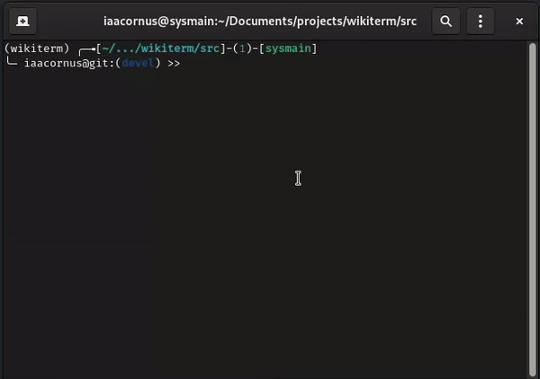

# wikiterm

Is a cross platform CLI client (only tested in Linux tho) for wikipedia written in Python using [martin-majlis/Wikipedia-API](https://github.com/martin-majlis/Wikipedia-API).



# Install

Clone/download the repository and install the requirements:

```bash
git clone https://github.com/iaacornus/wikiterm
pip3 install -r requirements.txt
```

The dependencies can also be manually installed instead:

```bash
pip3 install pyenchant wikipedia-api 
```

Move the script or folder `src/` somewhere safe, and add `alias wiki="python <location of src/cli.py>"` to the end of your `.bashrc`.

# Contribute

Just fork the repository and open a pull request.